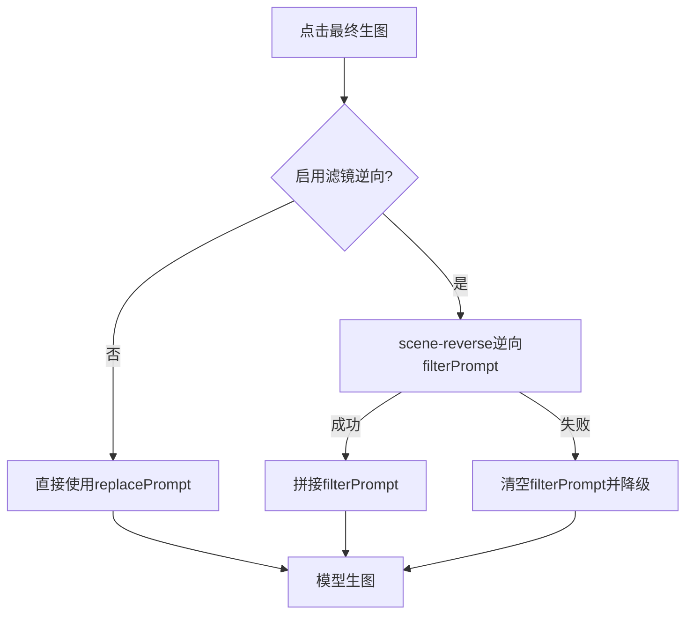

# AI Design Workbench
## 当前完整代码逻辑复盘

- 时间：2026-05-21
- 基线：`pure/1.md` + `pure/2.md`
- 目标：快速复盘、清晰表达、便于协作

---
layout: section
---

# 外显业务流程（4步）

---

## 4步主流程（UI可见）

1. 场景输入：模板/上传 + 可选裁剪
2. 模特输入：单张六视图参考图上传
3. 更换人物 Prompt：本地生成并可编辑
4. 最终生图：场景图 + 模特图 + 最终提示词

> 最终提示词 = `replacePrompt + 可选filterPrompt`

---
layout: two-cols
---

## 隐形流程（步骤4内部）

- 在最终生图前，可执行“滤镜逆向”
- 输入：原场景图
- 输出：`filterPrompt`
- 拼接：`composeFinalGenerationPrompt(replacePrompt, filterPrompt)`
- 失败降级：继续生图，不阻塞

::right::



---

## 模型分流逻辑

```ts
selectedModelProvider
  ├─ '豆包'            -> generateFinalArtworkWithDoubao()
  ├─ 'gpt-image-2'     -> generateFinalArtworkWithGptImage2()
  └─ 'nano banana pro' -> generateFinalArtworkWithNanoBananaPro()
```

- 三模型共享同一业务主链路
- 差异仅在最终生图服务层请求格式

---

## API 链路

### A. 滤镜逆向（scene-reverse）

1. `POST /api/scene-reverse/files/upload`
2. `POST /api/scene-reverse/chat-messages`
3. `answer -> prompts.filterPrompt`

### B. 最终生图（按模型分流）

- 豆包：`POST /api/doubao/images/generations`
- gpt-image-2：`POST /api/gpt-image-2`
- nano banana pro：`POST /api/nano-banana-pro`

---
layout: two-cols
---

## 状态管理（Store）

- `workspace`
  - `selectedModelProvider`
  - `enableFilterReverse`
  - `currentStepId` / `workflowStatus`
- `assets`
  - `selectedSceneAsset`
  - `selectedModelSet`（当前仅1张）
- `prompts`
  - `replacePrompt`
  - `filterPrompt`
- `generation`
  - `status` / `progress` / `logs`
  - `finalImageUrl` / `history`

::right::

## 持久化策略

- 统一走 `useWorkflowPersistence`
- localStorage key:
  - `ai-design-workbench:v1`
- 模特参考图仅持久化第一张
- blob/data URL 不做长期持久化

---

## 输入输出契约（当前版本）

### 必要输入

- 场景图（1张）
- 模特参考图（1张，内含六视图）
- replacePrompt（步骤3生成）

### 可选增强输入

- filterPrompt（由隐形逆向步骤产出）

### 最终输出

- finalImageUrl
- 生成记录（history）

---

## 关键文件地图

```text
src/composables/useGenerationFlow.ts      # 主流程编排
src/views/HomeView.vue                    # 页面组合与事件桥接
src/services/doubaoImage.ts               # 豆包模型服务
src/services/gptImage2.ts                 # gpt-image-2 / nano banana pro 服务
src/services/sceneReverse.ts              # 滤镜逆向服务
src/services/promptComposer.ts            # 提示词拼接
src/stores/*.ts                           # 状态管理
src/composables/useWorkflowPersistence.ts # 本地持久化
vite.config.ts                            # 开发代理
```

---
layout: center
---

# 复盘结论

当前代码已形成：

`外显4步 + 隐形滤镜逆向 + 三模型分流`

可用于后续需求迭代与对外逻辑讲解。
